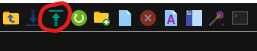
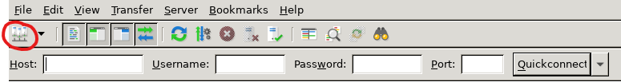
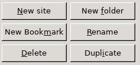
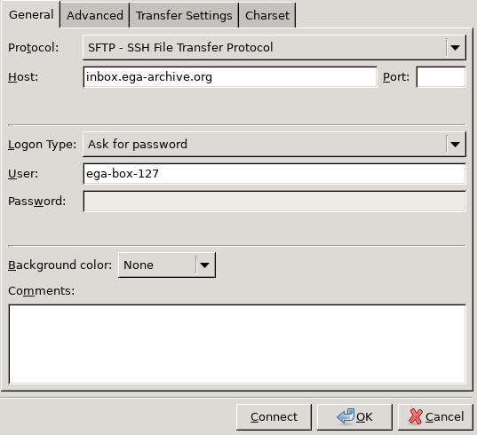
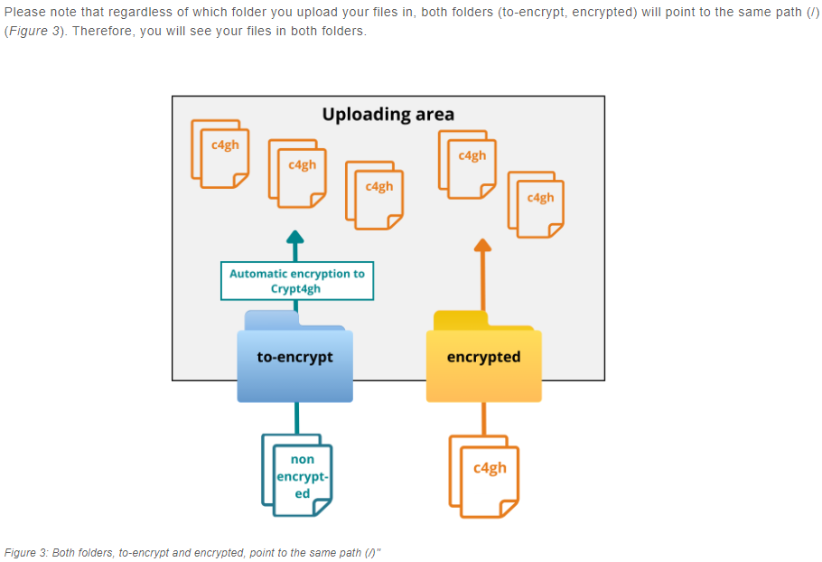
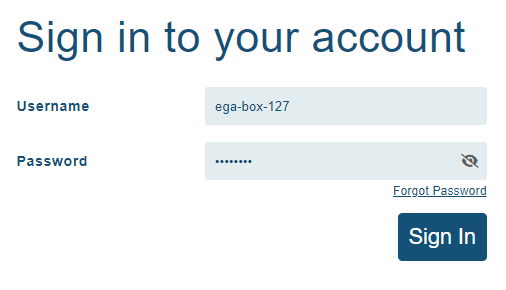

# FileZilla Submission

## Notes

All files submitted via FileZilla should be encrypted by Crypt4GH. For more information please review [EGA Inbox Submission](https://ega-archive.org/submission/data/uploading-files/inbox/)

## Step 1. Download the latest FileZilla

Downloaded the file: FileZilla_3.67.1_x86_64-linux-gnu.tar.xz from the link.

## Step 2. Import downloaded file

Upload the file into your Ares working directory.



## Step 3. Unzip the .tar.xz file and run ./filezilla

Unzip the tar file running:
```bash

   tar -xf FileZilla_*latest version*_x86_64-linux-gnu.tar.xz 
```
Start FileZilla by running:
```bash

   ./filezilla 
```
TIP: In case you are having issues when running this command, try changing and keeping track of your working environment by running:
```bash

   env | sort > env_working.txt 
```
## Step 4. Open the site manager and add a New site



## Step 5. Set up the general settings
Set up the Transfer Protocol and Login information with the following settings:


## Step 6. Select encrypted/to-encrypt files 
Select the files you want to submit and if they are already encrypted, move to the encrypted folder; otherwise, move to the to-encrypt folder.


## Step 7. Confirm your submission
After the submission shows as completed on FileZilla, you can verify if your files are visible on the submission portal by logging in to the ega-box > Files and filtering in descendant manner on the "Created" column. 

